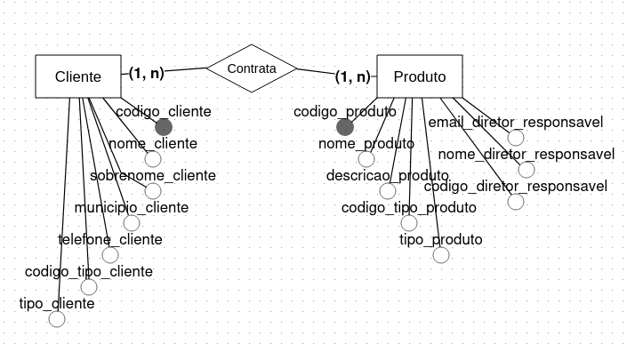
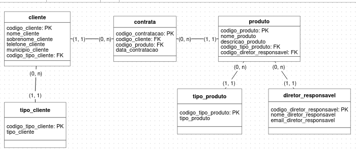

# Projeto para Diciplina Banco de Dados I

_Este projeto consiste no trabalho final do 3º módulo da trilha de Data Science do Programa Santander Coders 2024.1._ 

* **Módulo** Banco de Dados I
* **Instrutor:** Prof. Lucas Ximenes
* **Grupo**: Gabriel Marques ([GitHub](https://github.com/marqsleal) / [LinkedIn](https://www.linkedin.com/in/marqsleal/)), Marcos Carvalho ([GitHub](https://github.com/MarcosFN2014) / [LinkedIn](https://www.linkedin.com/in/marcos-carvalho-8173a2241/)), Mateus Cunha ([GitHub](https://github.com/Mateusclm) / [LinkedIn](https://www.linkedin.com/in/mateusclm/)) e Mille Amorim ([GitHub](https://github.com/4m0r1m) / [LinkedIn](https://www.linkedin.com/in/mille-amorim/)).

## Modelagem e normalização de bancos de dados relacionais

Certo dia, um dos gestores do banco em que você trabalha como cientista de dados procurou você pedindo ajuda para projetar um pequeno banco de dados com o objetivo de mapear os clientes da companhia pelos diferentes produtos financeiros que eles contrataram.

O gestor explicou que o banco tinha uma grande quantidade de clientes e oferecia uma variedade de produtos financeiros, como cartões de crédito, empréstimos, seguros e investimentos. No entanto, eles estavam tendo dificuldades para entender quais produtos eram mais populares entre os clientes e como esses produtos estavam interagindo entre si.

Como ponto de partida, o gestor deixou claro que um cliente pode contratar vários produtos diferentes, ao passo que um mesmo produto pode também estar associado a vários clientes diferentes e elaborou um rústico esboço de banco de dados com duas tabelas, da seguinte forma:

### Tabela 1

**Nome da tabela:** cliente  
**Colunas:** `codigo_cliente`, `nome_cliente`, `sobrenome_cliente`, `telefone_cliente`, `municipio_cliente`, `codigo_tipo_cliente`, `tipo_cliente`

### Tabela 2

**Nome da tabela:** produto  
**Colunas:** `codigo_produto`, `nome_produto`, `descricao_produto`, `codigo_tipo_produto`, `tipo_produto`, `codigo_diretor_responsavel`, `nome_diretor_responsavel`, `email_diretor_responsavel`

### Perguntas:

### 1. Ainda sem fazer normalizações, apresente o modelo conceitual deste esboço oferecido pelo gestor, destacando atributos chaves e apresentando também a cardinalidade dos relacionamentos.

<p align="center">
  
</p>

Relação Cliente(1,N) - Contrata - (N,1) Produto. Um cliente pode contratar vários produtos e um produto pode ser contratador por vários clientes. Construindo, portanto, uma relação total muitos para muitos (N,N), sendo necessário uma tabela para coordenar esta relação.

### 2. Agora apresente um modelo lógico que expresse as mesmas informações e relacionamentos descritos no modelo original, mas decompondo-os quando necessário para que sejam respeitadas as 3 primeiras formas normais. Destaque atributos chaves e apresente também a cardinalidade dos relacionamentos.

**Formas normais**:

**1ª Forma normal (1FN)**: Todos os atributos contém valores atômicos, indivisíveis, não podendo haver conjuntos, listas ou múltiplos valores em uma única coluna.  
**2ª Forma normal (2FN)**: Todos os atributos não-chave devem depender totalmente da chave primária, não podendo haver dependência parcial.  
**3ª Forma normal (3FN)**: Nenhum atributo não-chave deve depender de outro atributo não-chave, não podendo haver dependência transitiva.  

<p align="center">
  
</p>

**Resumo das Cardinalidades**:

**1. Cliente - Contrata - Produto**
- **Cliente (1:N)** - **Contrata (N:1)** - **Produto**
  - Um **Cliente** pode contratar vários **Produtos**.
  - Um **Produto** pode ser contratado por vários **Clientes**.
  - Relacionamento **N:N** resolvido pela tabela associativa **Contrata**.

**2. Tipo_Cliente - Cliente**
- **Tipo_Cliente (1:N)** - **Cliente (N:1)**
  - Um **Tipo_Cliente** pode estar associado a vários **Clientes**.
  - Um **Cliente** tem apenas um **Tipo_Cliente**.

**3. Tipo_Produto - Produto**
- **Tipo_Produto (1:N)** - **Produto (N:1)**
  - Um **Tipo_Produto** pode estar associado a vários **Produtos**.
  - Um **Produto** tem apenas um **Tipo_Produto**.

**4. Diretor_Responsavel - Produto**
- **Diretor_Responsavel (1:N)** - **Produto (N:1)**
  - Um **Diretor_Responsavel** pode ser responsável por vários **Produtos**.
  - Um **Produto** tem apenas um **Diretor_Responsavel**.

## Consultas SQL simples e complexas em um banco de dados relacional 

Um exemplo de modelo de banco de dados com relacionamento muitos-para-muitos pode ser o de um
e-commerce que tem produtos e categorias, onde um produto pode pertencer a várias categorias e uma
categoria pode estar associada a vários produtos. Nesse caso, teríamos duas tabelas: "produtos" e
"categorias", com uma tabela intermediária "produtos_categorias" para relacionar os produtos às suas
categorias.

```sql
CREATE TABLE produtos (
id INT PRIMARY KEY AUTO_INCREMENT,
nome VARCHAR(100) NOT NULL,
preco DECIMAL(10, 2) NOT NULL
);
CREATE TABLE categorias (
id INT PRIMARY KEY AUTO_INCREMENT,
nome VARCHAR(100) NOT NULL
);
CREATE TABLE produtos_categorias (
produto_id INTEGER REFERENCES produtos(id),
categoria_id INTEGER REFERENCES categorias(id)
);
```

Assim, usando o subconjunto da "structured query language" chamado de DQL, produza consultas de modo a
atender cada uma das seguintes solicitações:  

### Perguntas:

### 3. Liste os nomes de todos os produtos que custam mais de 100 reais, ordenando-os primeiramente pelo preço e em segundo lugar pelo nome. Use alias para mostrar o nome da coluna nome como "Produto" e da coluna preco como "Valor". A resposta da consulta não deve mostrar outras colunas de dados.

```sql
SELECT nome AS Produto, preco AS Valor
FROM produtos
WHERE preco > 100.00
ORDER BY preco ASC, nome ASC;
```

### 4. Liste todos os ids e preços de produtos cujo preço seja maior do que a média de todos os preços encontrados na tabela "produtos".

```sql
SELECT id, preco
FROM produtos
WHERE preco > (SELECT AVG(preco) FROM produtos);
```

### 5. Para cada categoria, mostre o preço médio do conjunto de produtos a ela associados. Caso uma categoria não tenha nenhum produto a ela associada, esta categoria não deve aparecer no resultado final. A consulta deve estar ordenada pelos nomes das categorias.

```sql
SELECT categorias.nome AS Categoria, AVG(produtos.preco) AS Preco_Medio
FROM categorias
INNER JOIN produtos_categorias ON categorias.id = produtos_categorias.categoria_id
INNER JOIN produtos ON produtos_categorias.produto_id = produtos.id
GROUP BY categorias.nome
ORDER BY categorias.nome ASC;
```

## Inserções, alterações e remoções de objetos e dados em um banco de dados relacional

Você está participando de um processo seletivo para trabalhar como cientista de dados na Ada, uma das maiores formadoras do país em áreas correlatadas à tecnologia. Dividido em algumas etapas, o processo tem o objetivo de avaliar você nos quesitos Python, Machine Learning e Bancos de Dados. Ainda que os dois primeiros sejam o cerne da sua atuação no dia-a-dia, considera-se que Bancos de Dados também constituem um requisito importante e, por isso, esta etapa pode ser a oportunidade que você precisava para se destacar dentre os seus concorrentes, demonstrando um conhecimento mais amplo do que os demais.

### 6. Com o objetivo de demonstrar o seu conhecimento através de um exemplo contextualizado com o dia-a-dia da escola, utilize os comandos do subgrupo de funções DDL para construir o banco de dados simples abaixo, que representa um relacionamento do tipo 1,n entre as entidades "aluno" e "turma":

**Tabela 1**
Nome da tabela: aluno
Colunas da tabela: id_aluno (INT), nome_aluno (VARCHAR), aluno_alocado (BOOLEAN), id_turma (INT)

**Tabela 2**
Nome da tabela: turma
Colunas da tabela: id_turma (INT), código_turma (VARCHAR), nome_turma (VARCHAR)